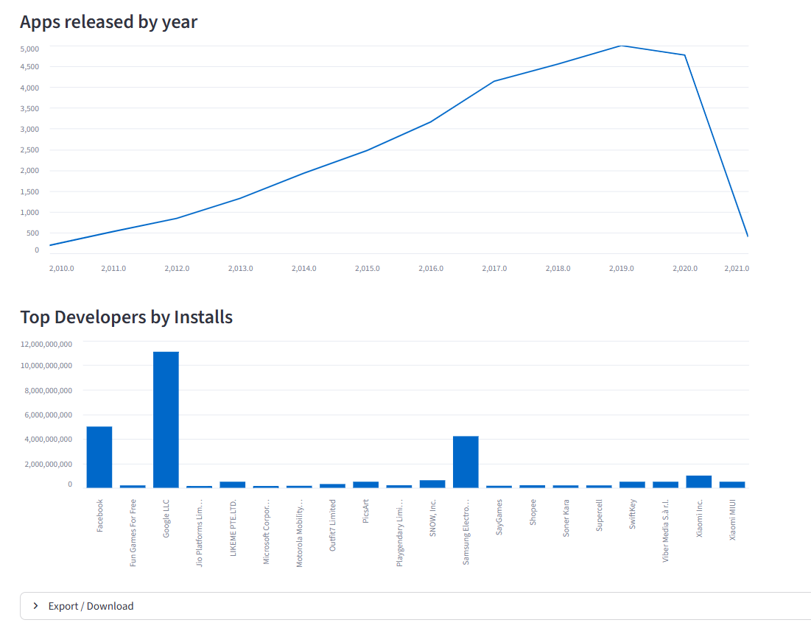

## 📱 Play Store App Analyzer

A Streamlit dashboard for exploring Google Play Store apps with **ML-based install-success prediction**.

---

## ⭐ Overview

Play Store App Analyzer is an interactive Streamlit application that helps **explore, visualize, and analyze** data from the Google Play Store.

It includes:
- 📊 Real-time charts
- 🔎 Advanced filters
- 📁 Full dataset loading with progress
- 🤖 Machine Learning model to predict whether an app will cross 1M+ installs

---

## 🚀 Features

# 🔹 1. Interactive Data Exploration
Filter apps by:
- Category
- Developer
- Price Type (Free / Paid)
- Rating
- Minimum installs
- View Top N app tables

# 🔹 2. Visual Analytics 
Includes professional charts such as:
- 📈 Category-wise install distribution
- ⭐ Rating distributions
- 🔁 Log-scaled Installs vs Reviews scatter plot
- 🧩 Top words in app names
- 📅 Release year trends
- 🏆 Top developers by total installs

# 🔹 3. Machine Learning Predictor
Model trained using:
- RandomForestClassifier
- Preprocessing 

# 🔹 4. Full Dataset Handling
- Loads sample CSV instantly
- Option to load full dataset (400K+ rows)
- Chunk reading with progress bar

---

## 📁 Project Structure

## 🔧 Setup Instructions

# 📥 Download the Dataset (Required)

👉 Download:
https://drive.google.com/file/d/1pqi9HbxutG6fdg48N6rpfFxk5B3ohiGb/view?usp=sharing

After downloading:
- Extract the ZIP
  Rename the main CSV file to:
  Playstore_final.csv

- Place it inside the folder:
  data/raw/

🧹 Clean the dataset

- Run:
  python src/clean.py

- This creates:
  data/cleaned/Playstore_cleaned.csv

### Install dependencies :
 pip install -r requirements.txt

### Train the Machine Learning model
python src/train_model.py

This generates the file:
models/app_success_clf.pkl

### Run the Streamlit dashboard
python -m streamlit run src/app.py

## 🖼️ Sample Output

### 🏠 Dashboard

### 📊 Category Chart and ⭐ Rating Distribution

### 🔁 Installs vs Reviews

### 🏆 Top Word Cloud

### 🏆 Release Year and Top Developers

### 📈 Top N Table

### 🤖 ML Predictor

